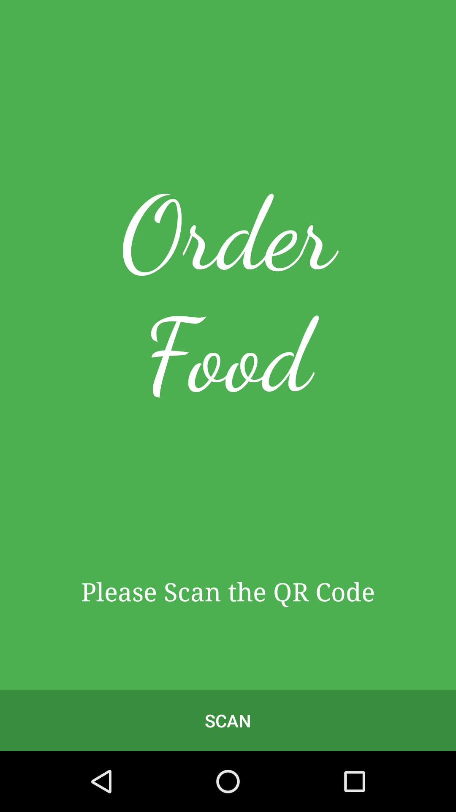
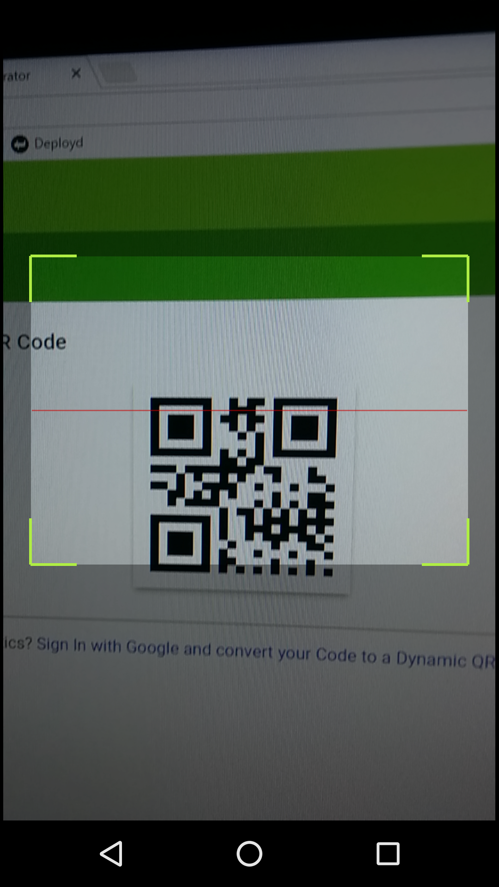
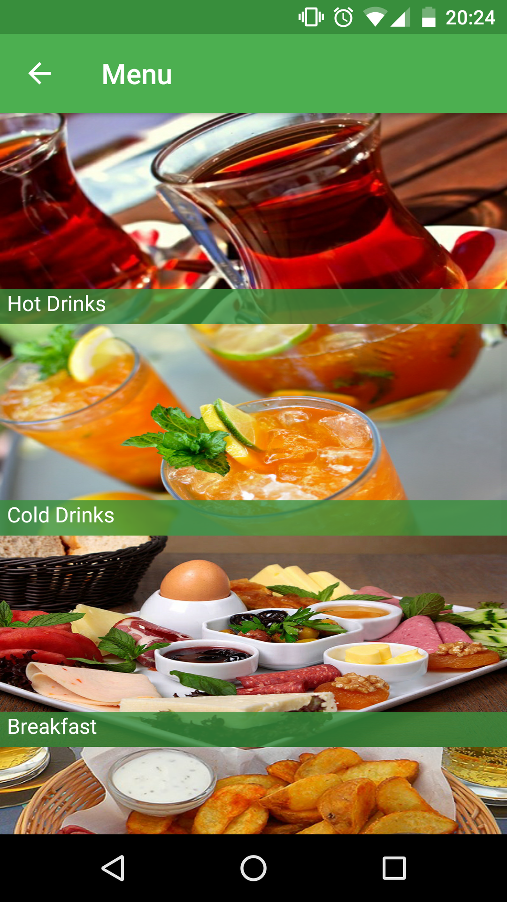

# **Order Food Android Application**

This project is created for CMPE 408 Final Project. First, open the app and get the table number by scanning the QR code. The user can then order food and call the waiter for a check. In addition, orders are saved in a database that users can use to view their order history.

## ScreenShots
       

## Installation & Usage
```bash
# Clone the repository
$ git clone https://github.com/omralcrt/OrderFood.git

# Import project to Android Studio
```

## License
	Copyright 2016 Ömral Cörüt
	
	Licensed under the Apache License, Version 2.0 (the "License");
	you may not use this file except in compliance with the License.
	You may obtain a copy of the License at
	
	  http://www.apache.org/licenses/LICENSE-2.0
	
	Unless required by applicable law or agreed to in writing, software
	distributed under the License is distributed on an "AS IS" BASIS,
	WITHOUT WARRANTIES OR CONDITIONS OF ANY KIND, either express or implied.
	See the License for the specific language governing permissions and
	limitations under the License.
